# Setting up a Mac
| 💡 I have an identical version of this guide, but it's but formatted slightly nicer [in Notion](https://jamesjingyi.notion.site/How-I-set-up-my-Mac-141c522194a480908a5cd3b07391d17f?pvs=4) |
|--|

> ## Optional: Reinstall macOS
> Reinstall macOS using this guide: https://support.apple.com/en-gb/guide/mac-help/mchlp1599/mac

This includes a lot of free apps I use on my Mac. I have a comprehensive list of these in [Github](https://github.com/jamesjingyi/free-mac-apps) and [Google Sheets](https://docs.google.com/spreadsheets/d/1QwpL1hjc878nSpuWTZwgIOyCc4r4pMusmxD6eC2UIXA/edit?usp=sharing).

# i. Preparation
Homebrew has a built in `bundle` feature which allows you to automate the installation of multiple packages, both from `brew`, and also from the Mac App Store using `mas`. I used to separate these out, but this is a much simpler process.

This uses a `Brewfile` which is a text file which lists all the packages which you want to install. A `Brewfile` can have the following types of line:
`tap` - A Homebrew tap to add
`brew` - A Homebrew formula to install
`cask` - A Homebrew cask to install
`mas` - A Mac App Store ID to install
`vscode` - A Visual Studio Code extension to install
`whalebrew` - Docker images ditributed using the `whalebrew` package manager

I currently do not use `whalebrew`. I also like to manually install my `vscode` extensions, so I do not include these in my `Brewfile`.

It is important to note that to use the `mas` command, you need to have installed the `mas` package, so you need to include this in your `Brewfile` above any `mas` lines.

A very basic `Brewfile` might look like this:

```
tap 'homebrew/cask'
brew 'mas'
mas "Xcode", id: 497799835
```

In this example, the `homebrew/cask` tap is added, the `mas` package is installed, and the `Xcode` app is installed from the Mac App Store.

If you have a current installation of Homebrew on an existing Mac that you want to replicate on another Mac, you can create a `Brewfile` by running the following command:

```
brew bundle dump
```

You can edit this `Brewfile` using TextEdit.

I have also included my own `Brewfile` in this repo, which you can use to install all the packages I use.

<br>


---

<br>

# 1 - Install apps
## 1.1 - Install Homebrew
Install Homebrew using the following command:
```
/bin/bash -c "$(curl -fsSL https://raw.githubusercontent.com/Homebrew/install/HEAD/install.sh)"
```

<br><br>

## 1.2 - Homebrew
### 1.2.1 - Brewfile placement
Place the `Brewfile` (which you downloaded from here, or created yourself) in your `/usr/` directory — you can get here in Finder by selecting `Go` > `Go to Folder...` (or pressing `⌘` + `⇧` + `G`) and typing `~/`. Terminal should launch here by default.

### 1.2.2 - Installation
Open Terminal and run the following command:
```
brew bundle install
```
(If you have your `Brewfile` in a different location, you can specify this by running `brew bundle install /path/to/Brewfile`)

### 1.2.3 - Auto-updates
I like my packages to update automatically, so I use the `Homebrew Autoupdate` package which just uses the built-in autoupdate mechanism within Homebrew. It is in my Brewfile, but if you want to install it yourself, you need to use:

```
brew tap domt4/autoupdate
```

I then configure it using the options:

```
brew autoupdate start 43200 --upgrade --cleanup --immediate --sudo
```

This is the example from the Autoupdate Github which:

> Upgrade[s] all your casks and formulae every 12 hours and on every system boot.
> 
> 
> If a sudo password is required for an upgrade, a GUI to enter your password will be displayed.
> Also, it will clean up every old version and left-over files.
> 
> Casks that have built-in auto-updates enabled by default will not be upgraded.
> 

If you have set a `brew autoupdate` and want to change it, you first have to run:

```
brew autoupdate delete
```

Then run another `brew autoupdate start` command with your new parameters.

> ## Alternative to using a `Brewfile`
> Previously instead of a `Brewfile`, I would install my packages using two separate files, separating out the Homebrew packages from those from the Mac App Store. This resulted in two files:
> - `packages.txt` - This file lists all the packages I want installed from Homebrew
> - `mas-apps.txt` - This file lists all the packages I want installed from the Mac App Store (using the `mas` package)

> You can find examples of these files in the `old-package-method` folder of this repo. If you wish to use them, download them to your `Downloads` folder and:
> 1. `cd` to the `Downloads` folder in Terminal using:
> ```
> cd Downloads/
> ```

> 2. Install all the packages recursively in `packages.txt` by running the command:
> ```
> brew install $(grep -v '^--cask' packages.txt) && brew install --cask $(grep '^--cask' packages.txt | sed 's/^--cask //')
> ```
> `brew install` can install multiple packages at once by just queueing them up, one after another (e.g. `brew install gh bitwarden-cli`), however has to install `cask` and `non-cask` packages separately. The above command separates this into two commands.

> 3. Now use `mas` to install previously purchased/installed apps from the Mac App Store using the following command:
> ```
> grep -v '^\s*#' mas-apps.txt | awk '{print $1}' | xargs -n 1 mas install
> ```

## 1.3 - iOS/iPadOS Apps from the Mac App Store
These cannot be downloaded using `mas`. You have to download these manually. Currently the two I have installed are:
|App name|Link|
|--|--|
|`BlueSky`|Mac App Store - [BlueSky](https://apps.apple.com/gb/app/bluesky-social/id6444370199)|
|`X`|Mac App Store - [BlueSky](https://apps.apple.com/gb/app/x/id333903271)|

<br>


## 1.4 - Other sources
**1.4.1** - The other apps I install outside of these two places are:
|App name|Link|
|--|--|
|`Lossless Switcher`|Github - [Lossless Switcher](https://github.com/vincentneo/LosslessSwitcher)|
|`OpenType Feature Freezer`|Github - [OpenType Feature Freezer](https://twardoch.github.io/fonttools-opentype-feature-freezer/)|
|`ShazamScrobbler`|Github - [ShazamScrobbler for Mac](https://github.com/ShazamScrobbler/macos-app)|
|`AirBattery`|Github - [AirBattery](https://lihaoyun6.github.io/airbattery/)|
|`TheBoringNotch`|Github - [TheBoringNotch](https://github.com/TheBoredTeam/boring.notch)|

**1.4.2** - `TheBoringNotch` is not yet signed by Apple, so when first launched, it will show a popup saying it is untrusted. Click `Okay`, then on your Mac go to `Settings` > `Privacy & Security`  and scroll until you see a button saying `Open Anyway`.

<br>

## 1.5 - Additional app downloads
**1.5.1** - **Adobe**:  `brew` will have installed `Creative Cloud` but it will not have installed the apps. Sign in and download the apps.
**1.5.2** - **Xcode**: Xcode needs to install additional bits. Launch it and download the relevant environments.
<br><br>

---
<br>

# 2 - Install fonts
## 2.1 - Google Fonts
Install all the fonts from the [`google/fonts`](https://github.com/google/fonts) repository by doing the following:
```
cd ~/Library/Fonts/
```
```
git clone https://github.com/google/fonts.git google-fonts
```

> **Updating fonts**
> ``` cd ~/Library/Fonts/google-fonts/ ```
> ``` git pull ```
>
> **Removing fonts**
> ``` rm -rf ~/Library/Fonts/google-fonts/ ```
> Source: [How to Install ALL Google Fonts on
> macOS](https://www.junian.net/tech/macos-google-fonts/)

<br>

## 2.2 - Apple Fonts
I usually need to use some of Apple’s fonts (like San Francisco), so I download them from Apple [here](https://developer.apple.com/fonts/).
<br><br>

## 2.3 - Fontshare
There is no way to install all of these at once. Unfortunately you have to go and select 'Download' on each [here](https://www.fontshare.com).
<br><br><br>


---
<br>

# 3 - Settings
## 3.1 - System Preferences
### 3.1.1 - Desktop and Dock
I turn on `Automatically hide and show the Dock` and set the size and magnification as shown here:
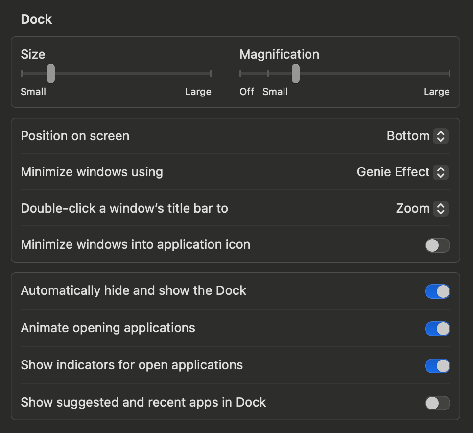

In `Desktop & Stage Manager` I also set `Click wallpaper to reveal desktop` to `Only in Stage Manager` and turn off `Stage Manager`
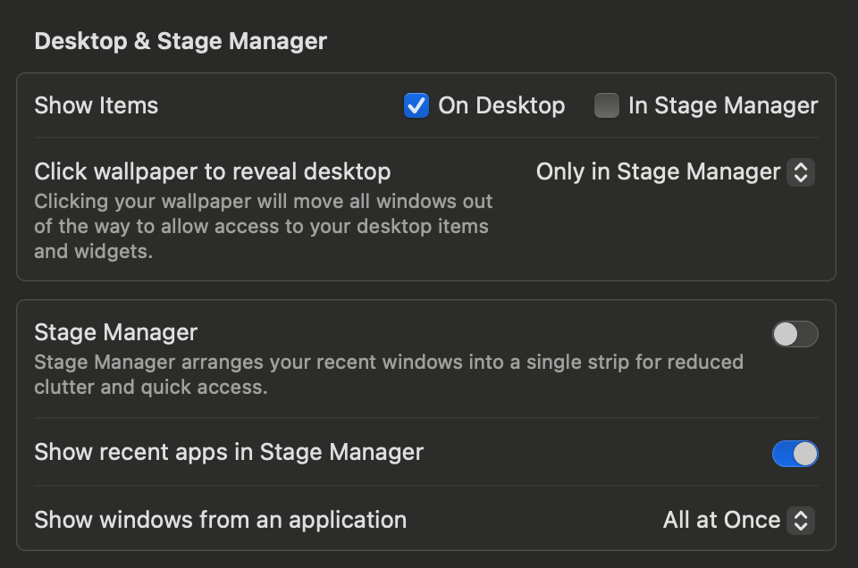

### 3.1.2 - Windows
I turn on `Hold ⌥ key while dragging windows to tile` and turn off `Tiled windows have margins`

### 3.1.3 - Mission Control
I turn on `Group windows by application`
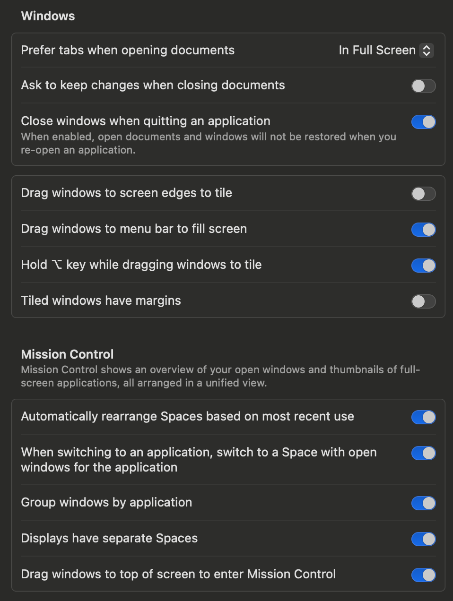

### 3.1.4 - Trackpad
I change the gesture for Mission Control to Swipe Up with Three Fingers
I turn on the gesture for `App Exposé` - `Swipe Down with Three Fingers`

### 3.1.5 - Keyboard Shortcuts
Since I use `Shottr` for screenshots, I change the `Copy` default to add an `⌥` modifier e.g. `⇧` + `⌘` + `3` -> `⌥` + `⇧` + `⌘` + `3`
Also since I use `Raycast` instead of `Spotlight`, I change from `⌘` + `Space` to `⌥` + `Space`
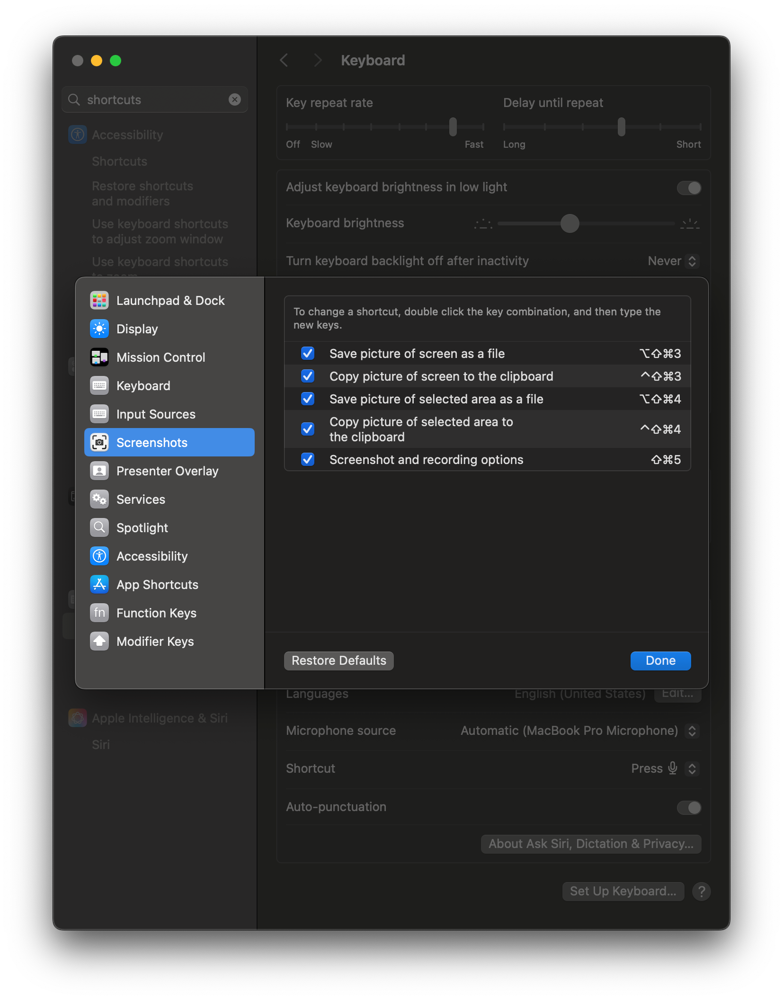
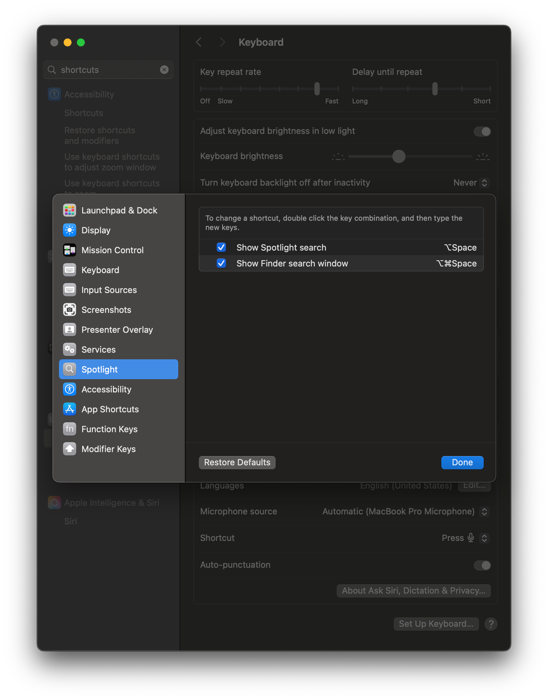

### 3.1.6 - Control Centre (and menu bar)
I ensure that `Bluetooth` is set to `Show in Menu Bar` — it doesn’t always show up here.
I also change `Sound` to `Always Show in Menu Bar` .

<br><br>

# 3.2 - Preinstalled Apps
## 3.2.1 - Finder
### 3.2.1.1 - Preferences
Finder’s sidebar is never used enough imo, so I open Finder, do `⌘` + `,` to open `Preferences` and:
- In `General`, ensure `Sync Desktop & Documents folders` is checked since I want my Desktop and Documents to be synced via iCloud
- In `Sidebar` select everything (apart from `On My Mac`)
### 3.2.1.2 - Other customisations
- I drag `Documents` and `Desktop` from the `iCloud` section in the Sidebar up to the `Favourites` section above (this just makes much more sense for me)
- I turn on the `Path Bar` by going to `View` > `Show Path Bar`
- In my `Downloads` folder I set this up for how it best works for me:
	- I always want it to be sorted by `Date Last Added`, so I set this for both `View` > `As Icons` and `View` > `As List`
    - In `List` view I also add `Date Modified` as this can sometimes be useful
### 3.2.1.3 - In other apps
When you’re in other apps, the selection interface can be hard to use, especially with your `Downloads` folder which can often be shown in the `Columns` view. In this view, it sorts alphabetically and you can’t seem to find blank space to right click and sort by `Date Last Added`. To rectify this, change it to `Icons`, and you’ll be able to find space in-between documents to right click.
<br><br>

## 3.2.2 - Safari
I am not sure why, but Safari likes to default to open with a new window every time you start it up. I always change it to:
`Safari opens with:` `All windows from last session`
<br><br>

## 3.2.3 - Dock
We already talked about the Dock settings before, but I like to separate out the items on my Dock using spacers. There are two types of spacer, small and regular. Regular is the same size as a full app, whereas small is half the width. I use small spacers.
<br><br>

To add these, you have to run the corresponding command in `Terminal`. Sometimes this doesn’t work, so re-run it until it adds one. Once one is added, drag and position it before adding another — the success rate of adding another seems to go up if you drag the one you just added away.

The commands to add spacers are as follows:

### 3.2.3.1 - Small spacer
```
defaults write com.apple.dock persistent-apps -array-add '{"tile-type"="small-spacer-tile";}'; killall Dock
```

### 3.2.3.2 - Large spacer
```
defaults write com.apple.dock persistent-apps -array-add '{"tile-type"="spacer-tile";}'; killall Dock
```
<br><br>

# 3.3 - Replacing default macOS functions
## 3.3.1 - Raycast
I prefer Raycast to Spotlight — it has many more functions and I can customise it more. I am by no means a power user, but I have adjusted it so that it works for me.
<br><br>

### 3.3.1.1 - Extensions
Raycast has a Store which allows you to install `Extensions` which can run functions on your Mac, both system and app-specific. When I first started using Raycast, I ended up adding loads and loads of extensions, and both forgetting about functions, and also being overwhelmed when I searched for a function. There a few ways I have combatted this:
1. **I only install Extensions I will actually use** — This seems simple, but I am definitely an optimistic downloader. I have tamed this somewhat. If I am browsing the Store, I carefully check my own workflow to identify if I think an extension would actually make sense (do I use this function commonly? Would I actually think to use Raycast rather than a web app?).
2. **I only enable the parts of the Extensions that I want** - This is something I didn’t really think about properly until recently, but this actually made my menus much less overwhelming. In the `Extensions` tab, I go through and expand each Extension and uncheck all the Commands which duplicate other functionality, or I just don’t want.
3. **I add Aliases** - See the below section, I think these are great!

Below I have written out the Extensions I have installed, and the Commands I have enabled for each of them, often slimmed down significantly (if you search for them in the Store, lots have a lot more than the number I have enabled!). Any spaces have been shown as underscores (`_`).

| Extension Name | Commands Enabled | Command Alias |
|:----|:---:|:---:|
| Apple Maps Search | Search Maps | `-` |
| Arc | Open New Little Arc Window<br>Search Tabs | `little_arc`<br>`arc_search` |
| Bitwarden Vault | Generate Password<br>Search Vault | `-`<br>`bw` |
| Brew | Clean Up<br>Search<br>Show Installed<br>Show Outdated<br>Upgrade | `-`<br>`-`<br>`-`<br>`-`<br>`brew_upgrade` |
| Calendar | My Schedule | `sch` |
| Change Case | - | `case` |
| Clipboard History | - | `clip` |
| Coffee | Caffeinate<br>Caffeinate For<br>Caffeinate While<br>Decaffeinate | `caf`<br>`caf_for`<br>`caf_while`<br>`decaf` |
| Color Picker | Color Names<br>Convert Color<br>Pick Color | `colour_ _name`<br>`colour_conv`<br>`colour_picker` |
| Define Word | - | `def` |
| Google Search | - | `google` |
| Kill Process | - | `-` |
| Link Cleaner | - | `link_clean` |
| Music | Add to Library<br>Next Track<br>Pause<br>Play<br>Previous Track<br> | `-`<br>`next`<br>`pause`<br>`play`<br>`back` |
| Navigation | Search Menu Items<br>Switch Windows | `-`<br>`-` |
| Notion | Search Notion | `notion_search` |
| Quicklinks | Export Quicklinks<br>Import Quicklinks | `-`<br>`-` |
| Raycast | Confetti<br>Manage Fallback Commands<br>Quit Raycast<br>Refresh Apps and Settings<br>Reset Raycast Window Position<br>Run Last Command<br>Search Quicklinks<br>Store<br>Walkthrough | `-`<br>`-`<br>`-`<br>`-`<br>`-`<br>`-`<br>`-`<br>`extensions`<br>`-` |
| Raycast Settings | Al<br>About<br>Account<br>Advanced<br>Cloud Sync<br>Extensions<br>General<br>Organizations | `-`<br>`-`<br>`-`<br>`-`<br>`-`<br>`-`<br>`-`<br>`-`<br> |
| Ruler | - | `-` |
| Screenshot | All in One<br>Capture Area<br>Capture Screen<br>Capture<br>Timer<br>Capture Window<br>Capture Window To Clipboard<br>Capture and Annotate<br>Capture to Clipboard | `-`<br>`-`<br>`cap_s`<br>`-`<br>`cap_w`<br>`-`<br>`-`<br>`-` |
| Screenshots | Paste Recent Screenshot<br>Search Screenshots | `-`<br>`-` |
| Search Browser Tabs | - | `browser` |
| Search Device | - | `-` |
| Search Emoji & Symbols | - | `emoji` |
| Search Files | - | `-` |
| Shortcuts | - | `-` |
| Snippets | Create Snippet<br>Export Snippets<br>Import Snippets<br>Search Snippets | `-`<br>`-`<br>`-`<br>`-` |
| System | Empty Trash<br>Lock Screen<br>Quit All Applications<br>Set Volume to 0%<br>Shut Down | `-`<br>`-`<br>`-`<br>`vol_0`<br>`-` |
| Translate | - | `-` |
| View 2FA Codes | - | `2fa` |
| Webpage to Markdown | - | `webpage_ _markdown` |
| Wifi Password Reveal | - | `wifi_reveal` |
| Window Management | Bottom Half<br>Bottom Left Quarter<br>Bottom Right Quarter<br>Left Half<br>Maximize<br>Top Left Quarter<br>Top Right Quarter | `b`<br>`b,`<br>`b.`<br>`,`<br>`fs`<br>`t`<br>`t,`<br>`t.` |

### 3.3.1.2 - Aliases
Adding Aliases actually was actually a game-changer. These allow you to assign characters to Extension (which includes each app), meaning when you type these, Raycast suggests this first. This even works if you haven’t typed the whole of the Alias, suggesting it above the default search.I now have double or triple letter Aliases set so I can quickly launch them.

These are also good for when something has been renamed, or if you can’t remember the name of something but can remember its function (or want to group applications by function). For example I have **Terminal** set to `term` and **Warp** set to `term2`, and **X** set to `twi`.

I have the Extensions Aliases above, but for apps specifically I have:
| App Name | Alias |
|:----|:---:|
| Adobe Acrobat | `acrobat` |
| Adobe Illustrator | `il` |
| Adobe InDesign | `id` |
| Adobe Lightroom | `lr` |
| Adobe Media Encoder | `media_enc` |
| Adobe Photoshop | `ps` |
| Adobe Premiere Pro | `premiere` |
| App Store | `app` |
| App Cleaner | `clean` |
| Arc | `arc` |
| Blender | `blend` |
| Bluesky | `bs` |
| Calendar | `cal` |
| ChatGPT | `ch` |
| Figma | `fig` |
| Final Cut Pro | `fcp` |
| Firefox | `ff` |
| ImageOptim | `img` |
| Keynote | `key` |
| Logic Pro | `lp` |
| Messages | `msg` |
| Messenger | `fb_messenger` |
| Microsoft Excel | `excel` |
| Microsoft PowerPoint | `powerpoint` |
| Microsoft Teams | `teams` |
| Microsoft Word | `word` |
| Music | `music` |
| News | `news` |
| Notes | `notes` |
| Notion | `notion` |
| Numbers | `numbers` |
| Pages | `pages` |
| Perplexity | `pp` |
| Photos | `photos` |
| Podcasts | `podcasts` |
| QuickTime Player | `qt` |
| Safari | `saf` |
| Simulator | `sim` |
| Sketch | `sk` |
| Sketch Beta | `skb` |
| Slack | `sla` |
| System Settings | `pref` |
| Terminal | `term` |
| TextEdit | `te` |
| Visual Studio Code | `vsc` |
| Warp | `term2` |
| WhatsApp | `wa` |
| X | `twi` |
| Zen Browser | `zen` |

<br>

### 3.3.1.3 - Quicklinks
Quicklinks allow you to search quickly from Raycast and go straight to your browser (or even certain apps if they support it). Icons are usually automatically populated by `Raycast` which is great. You can also assign Aliases to these. Currently I have:
| Name | Alias | Link |
|:----|:---:|:---:|
| Amazon | `amz` | `https://www.amazon.co.uk/s?k={Query}` |
| ChatGPT | `chat` | `https://chatgpt.com?hint=search&q={query}` |
| Google Translate | `trans` | `https://translate.google.com/?sl={argument name="source language" default="auto"}&tl={argument name="target language"}&text={argument name="word"}&op=translate` |
| Open Desktop | `dsk` | `~/Desktop` |
| Open Documents | `doc` | `~/Documents` |
| Open Downloads | `dow` | `~/Downloads` |
| Open Root | `root` | `~/` |
| Perplexity | `per` | `https://www.perplexity.ai/search?copilot=true&q={query}` |
| Search Dribbble | `drib` | `https://dribbble.com/search/{argument}` |
| Search DuckDuckGo | `duck` | `https://duckduckgo.com/?q={argument}` |
| Search Google | `gs` | `https://google.com/search?q={argument}` |
| Search Unsplash | `uns` | `https://unsplash.com/s/photos/{argument}` |
| Search YouTube | `yt` | `https://www.youtube.com/results?search_query={argument}` |

You can add links directly to folders on your Mac. To do this:
1. Find the folder you want in Finder
2. Hold down `⌥` and click `Edit` then select `Copy ”Folder Name” as Pathname` (or use the keyboard shortcut `⌥` + `⌘` + `C`)
3. You will now have a pathname. You just need to remove `/Users/youruser` and replace this with `~/` e.g. for the Music folder it goes from `/Users/youruser/Music` to `~/Music`
4. Now just use this as your link in Raycast and name accordingly!

## 3.2.2 - Ice
To tidy up my menu bar I use `Ice`, where I place things is as follows:


## 3.2.3 - Shottr
I use `Shottr` instead of macOS’s built in screenshot utility. I prefer that it allows you to mark up, edit, crop, measure, and more!

It also has a super useful OCR feature which allows you to select an area on the screen and extract the text from it.

Since I want it to replace the default screenshots in macOS, I set it up to:
| Command | Shortcut
|:----|:---:|
| Fullscreen screenshot | `⇧` + `⌘` + `3` |
| Area screenshot | `⇧` + `⌘` + `4` |
| Instant Text/QR Recognition | `⇧` + `⌘` + `2` |
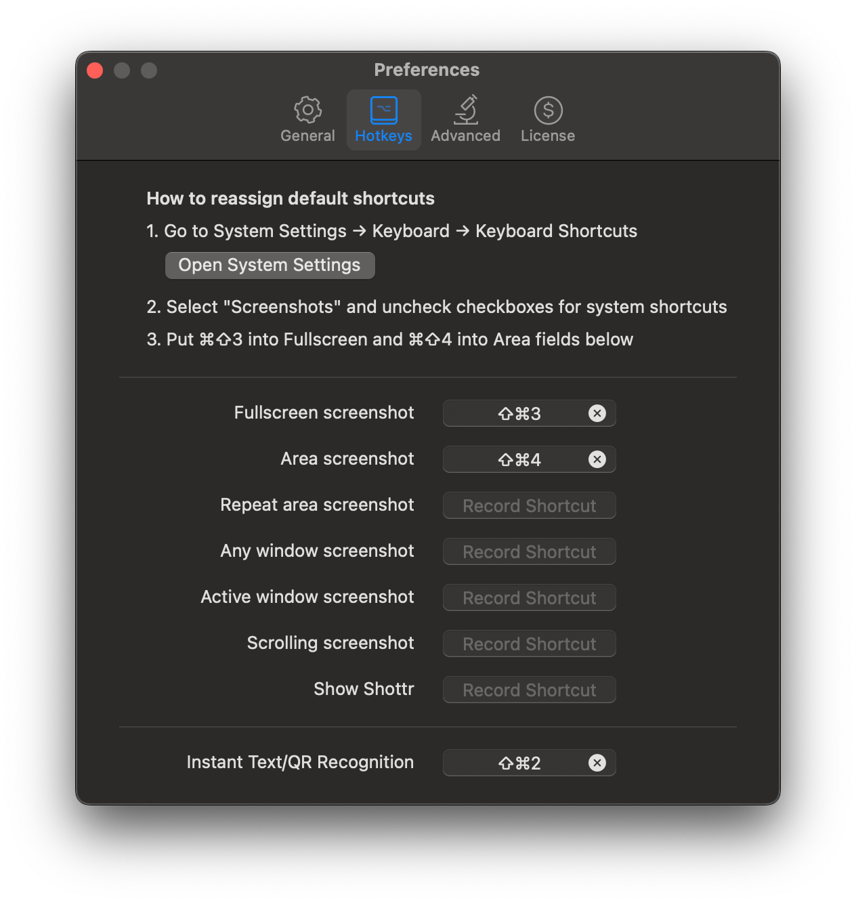

<br><br>

## 3.2.4 - Velja
I use Velja to automate switching to Arc for Google apps. They are as folllows:

|Name:|**Google Docs**|
|:----|:---:|
|Open in:|Arc|
|Sample URL:|`https://docs.google.com`|
|Detect via:|Domain|
|Match:|`docs.google.com`|
|Source Apps:| `Slack`<br>`Arc`<br>`Mail`<br>`Calendar`|

|Name:|**Google Meet**|
|:----|:---:|
|Open in:|Arc|
|Sample URL:|`meet.google.com`|
|Detect via:|Domain|
|Match:|`meet.google.com`|
|Source Apps:|<ul><li>Notion Calendar`<br>`Rewind`<br>`Arc`<br>`Slack`<br>`Mail`<br>`Calendar`|

|Name:| **Google Drive**|
|:----|:---:|
|Open in:|Arc|
|Sample URL:|`https://www.drive.google.com/`|
|Detect via:|Domain|
|Match:|`drive.google.com`|
|Source Apps:|`No Source Apps`|

|Name:|**Google Calendar**|
|:----|:---:|
|Open in:|Arc|
|Sample URL:|`https://calendar.google.com/`|
|Detect via:|Domain|
|Match:|`calendar.google.com`|
|Source Apps:|`No Source Apps`|

|Name:|**Jira**|
|:----|:---:|
|Open in:|Arc|
|Sample URL:|`https://atlassian.net/`
|Detect via:|Domain|
|Match:|`atlassian.net`
|Source Apps:|`No Source Apps`|

|Name:|**Harvest**|
|:----|:---:|
|Open in:|Arc|
|Sample URL:|`https://harvestapp.com/`|
|Detect via:|Domain|
|Match:|`harvestapp.com`|
|Source Apps:|`No Source Apps`|
| |
|Sample URL:|`https://getharvest.com/`|
|Detect via:|Domain|
|Match:|`getharvest.com`|
|Source Apps:|`No Source Apps`|


<br><br>

## 3.2.5 - Rocket (Emojis)
I prefer typing a `:` and searching to insert emoji. Rocket does this really well. I hide the Menu Bar icon using `Ice`.
<br><br>

# 3.4 - System Enhancements
## 3.4.1 - DockDoor
`DockDoor` shows you a preview of the windows you have open when you hover over them in the Dock.

I prefer it to be clean, quick and launch on login, so I change:
In `General`:
- I check `Launch DockDoor at login`
- `Preview Window Open Delay` > `0`
- `Window Size` > `Small`
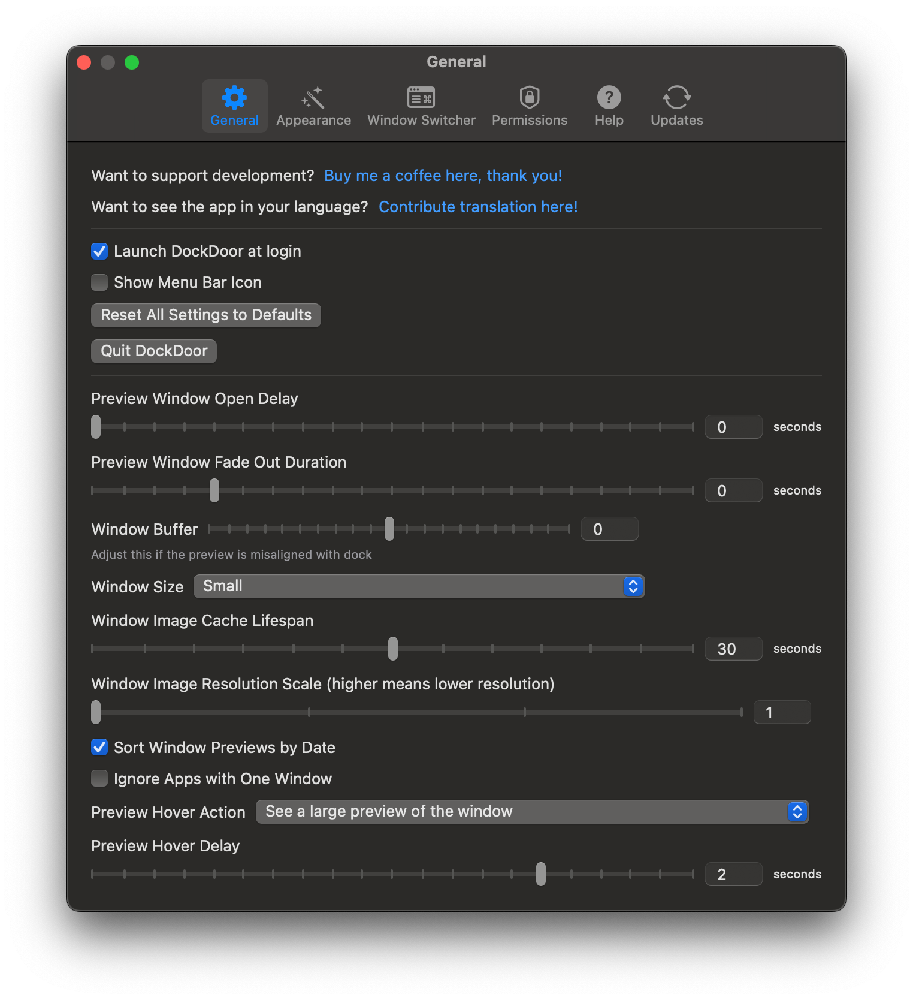

In `Appearance`:
- `Traffic Light Buttons Visibility` > `Never visible`
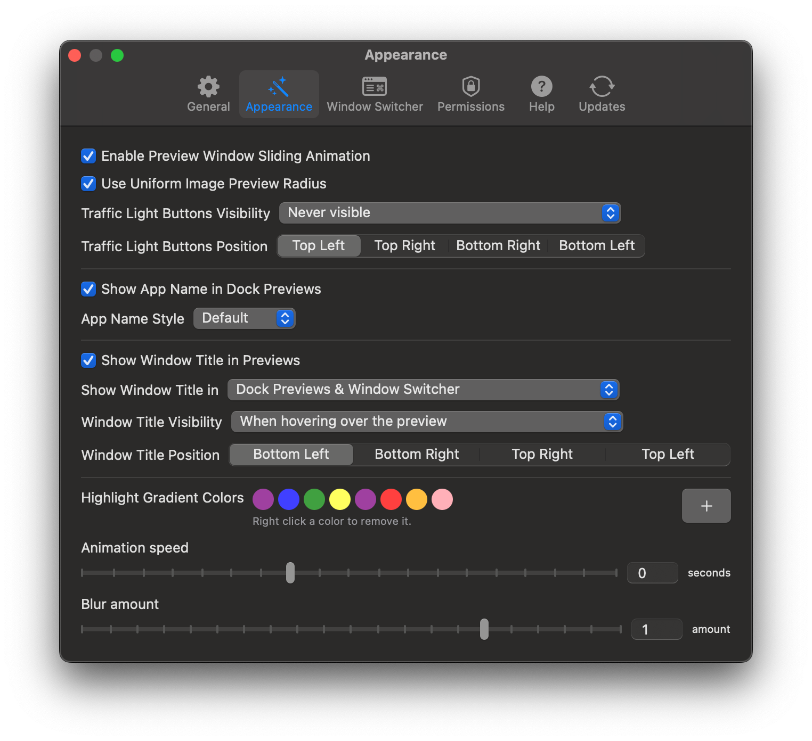

In `Window Switcher`:
- I uncheck `Enable Window Switcher`
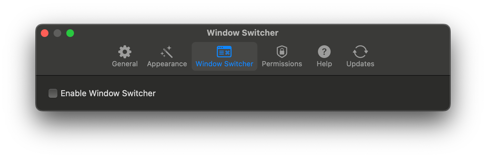

<br><br>

## 3.4.2 - Boring Notch
`Boring Notch` is a great app and has loads of functionality to make your notch more useful on MacBooks. They added the feature I really wanted — being able to assign this to only your MacBook screen when connected to external monitors.

I think everything is fine as default, though of course I enable `Launch at login`.

<br><br>

# 3.5 - Utilities
These are other utilities I use that aren’t necessarily tied to system functions, but things I install, and set to open on login (they are automatically downloaded in the `packages.txt` and `mas-apps.txt`).

## 3.5.1 - AutoSwitch
I like to use AutoSwitch as secondary menu to quickly access some advanced settings.

In `General` I set:
- `Launch:` `Launch at login` to `On`
- `Promotion:` `Show More Apps` to `Off`

In `Customisation` I turn on:
- `Hide Desktop Icons`
- `Autohide Dock`
- `Autohide Menu Bar`
- `Xcode Derived Data`
- `Show Hidden Files`
- `Empty Clipboard`
- `Show User Library Folder`
- `Show Extension Name`
- `Low Power Mode`
- `Show Finder Path Bar`
- `Screen Test & Clean`
- `True Tone`
- `Key Light`
- In here I also turn off `Hide Menu Bar Icons`

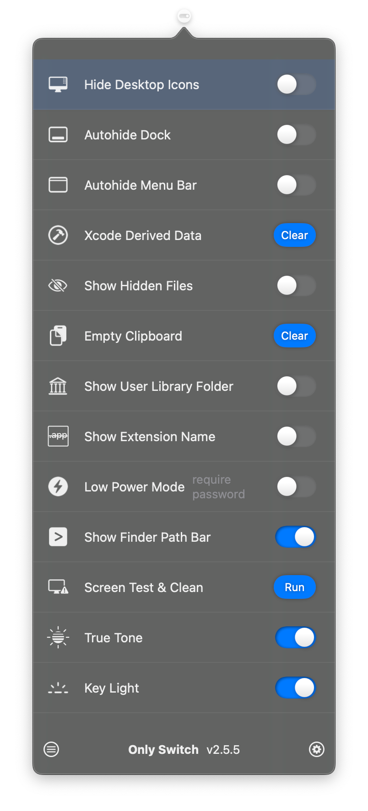

<br><br>

## 3.5.2 - MeetingBar
I use MeetingBar only for a single function, it shows a fullscreen notification when a meeting starts, meaning I can’t ignore it.

I therefore check `Launch after login` and `Show a fullscreen notification when event starts`.

I turn off basically everything else and hide it in my menu bar using `Ice`.

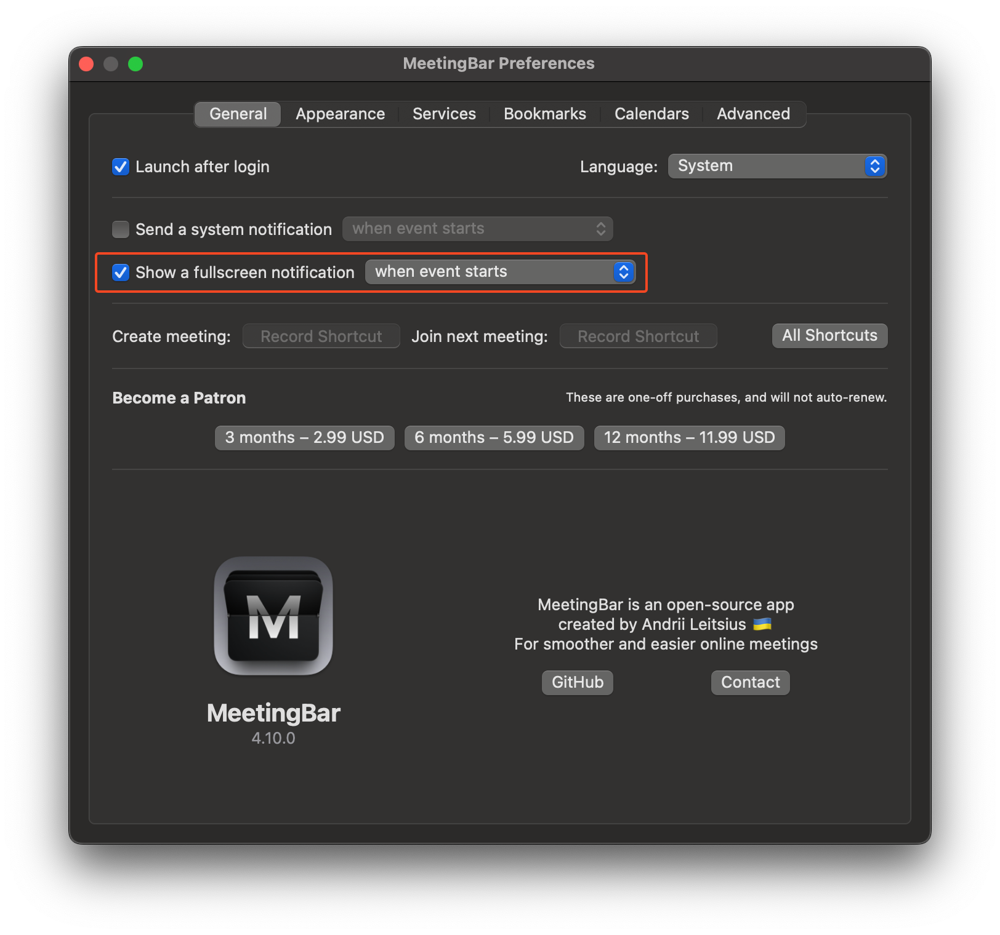

<br><br>

## 3.5.3 - Lossless Switcher
This ensures you’re always streaming the best quality when connected to AirPods or other Bluetooth headphones. In the Menu Bar, click the icon to see its settings. I like to have it in the hidden menu in `Ice` with `Show Sample Rate` selected so I can keep an eye on it.

<br><br>

## 3.5.4 - Amazon Q
This is a great autocomplete for Terminal, but by default it shares a lot of data with Amazon. Log in and then select the icon in the Menu Bar > `Settings`. Then under `Settings` > `Preferences` > `Advanced`, turn off `Share Amazon Q content with AWS` and `Telemetry`.

<br><br>

## 3.5.5 - AdGuard for Safari
I don’t generally block ads, but I prefer not to be tracked, and don’t like the popups on websites, including cookie notices. I therefore turn on:
- `Privacy`, with `AdGuard Tracking Protection filter` and `Peter Lowe's Blocklist`
- `Annoyances`, with `AdGuard Annoyances filter`

I also turn off `Show AdGuard for Safari in the menu bar`

<br><br>

## 3.5.6 - NepTunes
This is much better than the Last.fm app, for scrobbling. You just need to log in and grant access to your play history.

Also I disable the widget (`Widget`, uncheck `Show widget`).

<br><br>

## 3.5.7 - Apparency
This is a good app to have just so you can see all the details of any app on your system in one place.

<br><br>

## 3.5.8 - Syntax Highlight
This is a Quick Look Extension to previewing source files using Quick Look. Another great one to have.

<br><br>

# 3.6 - Removing things from the Menu Bar
Loads of apps like to have Menu Bar items, and mine’s already quite cluttered, even with Ice. I therefore go into each of these apps and turn them off:
- Notion
- ChatGPT
- Figma
