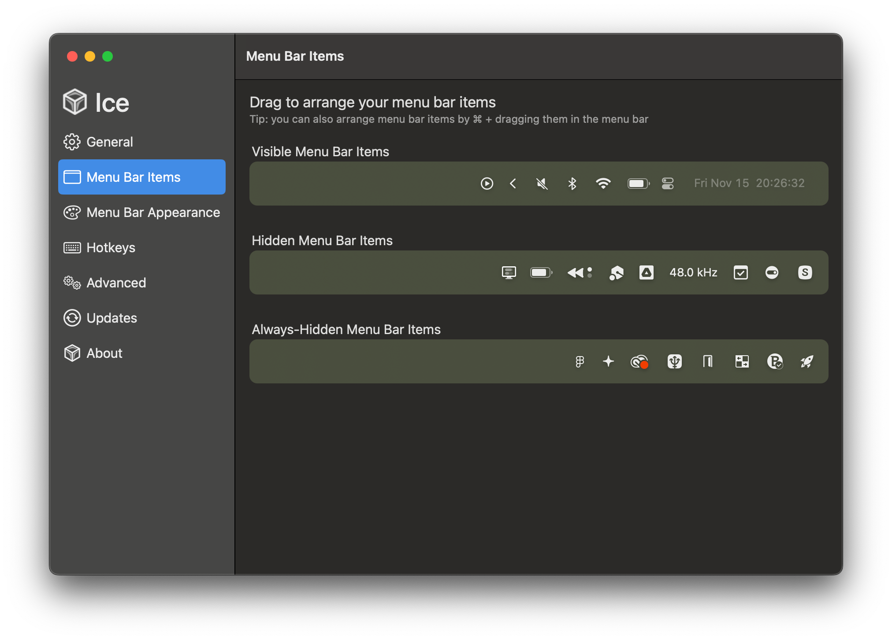

# Setting up a Mac

> ### Optional: Reinstall macOS
> Reinstall macOS using 

## Preparation
Download the following files:

 1. `packages.txt` 
 2. `mas-apps.txt`

For the commands later I have downloaded these to the `Downloads` folder (`Users/<username>/Downloads`) 

Open the Terminal, `cd` to the `Downloads` folder using:
```
cd Downloads/
```

## 1 - Install apps
### 1.1 - Homebrew
**1.1.1** - Install Homebrew using the following command:
```
/bin/bash -c "$(curl -fsSL https://raw.githubusercontent.com/Homebrew/install/HEAD/install.sh)"
```
**1.1.2** - Then install all the packages recursively in `packages.txt` by running the command:
```
brew install $(cat packages.txt)
```
### 1.2 - Mac App Store
**1.2.1** - Using the `mas` package installed in **Step 1.1.2**, install previously purchased/installed apps recursively using the following command:
```
grep -v '^\s*#' mas-apps.txt | awk '{print $1}' | xargs -n 1 mas install
```
**1.2.2** - iOS/iPadOS Apps cannot be downloaded using `mas`. You have to download these manually. Currently the two I have installed are:
|App name|Link|
|--|--|
|`BlueSky`|Mac App Store - [BlueSky](https://apps.apple.com/gb/app/bluesky-social/id6444370199)|
|`X`|Mac App Store - [BlueSky](https://apps.apple.com/gb/app/x/id333903271)|
### 1.3 - Other sources
**1.3.1** - The other apps I install outside of these two places are:
|App name|Link|
|--|--|
|`Lossless Switcher`|Github - [Lossless Switcher](https://github.com/vincentneo/LosslessSwitcher)|
|`OpenType Feature Freezer`|Github - [OpenType Feature Freezer](https://twardoch.github.io/fonttools-opentype-feature-freezer/)|
|`ShazamScrobbler`|Github - [ShazamScrobbler for Mac](https://github.com/ShazamScrobbler/macos-app)|
|`AirBattery`|Github - [AirBattery](https://lihaoyun6.github.io/airbattery/)|
|`TheBoringNotch`|Github - [TheBoringNotch](https://github.com/TheBoredTeam/boring.notch)
**1.3.2** - `TheBoringNotch` is not yet signed by Apple, so when first launched, it will show a popup saying it is untrusted. Click `Okay`, then on your Mac go to `Settings` > `Privacy & Security`  and scroll until you see a button saying `Open Anyway`.
### 1.4 - Additional app downloads
**1.4.1** - **Adobe**:  `brew` will have installed `Creative Cloud` but it will not have installed the apps. Sign in and download the apps.
**1.4.2** - **Xcode**: Xcode needs to install additional bits. Launch it and download the relevant environments.

## 2- Install fonts
### 2.1 - Google Fonts
Install all the fonts from the [`google/fonts`](https://github.com/google/fonts) repository by doing the following:
```
cd ~/Library/Fonts/
```
```
git clone https://github.com/google/fonts.git google-fonts
```

> **Updating fonts** 
> ``` cd ~/Library/Fonts/google-fonts/ ``` 
> ``` git pull ```
> 
> **Removing fonts** 
> ``` rm -rf ~/Library/Fonts/google-fonts/ ``` 
> Source: [How to Install ALL Google Fonts on
> macOS](https://www.junian.net/tech/macos-google-fonts/)

### 2.2 - Fontshare
There is no way to install all of these at once. Unfortunately you have to go and select 'Download' on each [here](https://www.fontshare.com)

# 3 - Settings
### 3.1 - Desktop and Dock
I turn on `Automatically hide and show the Dock` and set the size and magnification as shown here:


### 3.2 - Windows
I turn on `Hold ⌥ key while dragging windows to tile` and turn off `Tiled windows have margins`

### 3.3 - Mission Control
I turn on `Group windows by application`


### 3.4 - Trackpad
I turn on the gesture for `App Exposé` - `Swipe Down with Three Fingers`

### 3.5 - Keyboard Shortcuts
Since I use `Shottr` for screenshots, I change the `Copy` default to add an `⌥` modifier e.g. `⇧` + `⌘` + `3` -> `⌥` + `⇧` + `⌘` + `3`
Also since I use `Raycast` instead of `Spotlight`, I change from `⌘` + `Space` to `⌥` + `Space`


### 3.6 - Ice settings
To tidy up my menu bar I use `Ice`, where I place things is as follows:



### 3.7 - Raycast Extensions
I have installed:
- Apple Maps Search
- Apple Notes
- Arc
- Bitwarden Vault
- Coffee (caffienate)
- Notion
- Wifi Password Reveal

### 3.8 - Velja settings
I use Velja to automate switching for Google apps. They are as folllows:

Name: **Google Docs**
Open in: Arc
Sample URL: `https://docs.google.com`
Detect via: Domain
Match: `docs.google.com`
Source Apps:
- Slack
- Arc
- Mail
- Calendar

Name: **Google Meet**
Open in: Arc
Sample URL: `meet.google.com`
Detect via: Domain
Match: `meet.google.com`
Source Apps:
- Notion Calendar
- Rewind
- Arc
- Slack
- Mail
- Calendar

Name: **Google Drive**
Open in: Arc
Sample URL: `https://www.drive.google.com/`
Detect via: Domain
Match: `drive.google.com`
Source Apps: `No Source Apps`

Name: **Google Calendar**
Open in: Arc
Sample URL: `https://calendar.google.com/`
Detect via: Domain
Match: `calendar.google.com`
Source Apps: `No Source Apps`

Name: **Jira**
Open in: Arc
Sample URL: `https://atlassian.net/`
Detect via: Domain
Match: `atlassian.net`
Source Apps: `No Source Apps`

Name: **Jira**
Open in: Arc
Sample URL: `https://harvestapp.com/`
Detect via: Domain
Match: `harvestapp.com`

Sample URL: `https://getharvest.com/`
Detect via: Domain
Match: `getharvest.com`
Source Apps: `No Source Apps`
